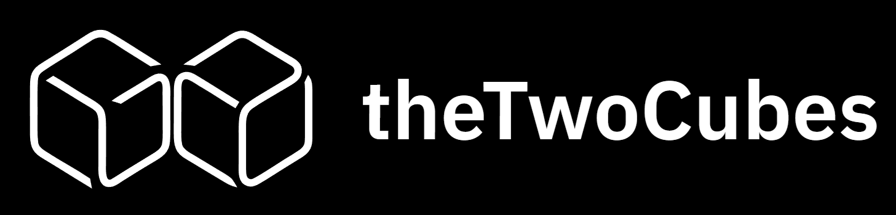

<h1 style="font-size: 4em; font-weight: 800; letter-spacing: -1px;">Akshat Mittal</h1>

 

---

## About Me

I am a developer and founder based in India. My work sits at the intersection of machine learning and product engineering. I build things that are technically sound and actually useful.

On the engineering side, I work across the full stack: deep learning research, backend systems, and frontend products. I have a strong foundation in algorithms and systems thinking, which I apply across everything I build.

On the business side, I founded **theTwoCubes** to turn that engineering into real products for real customers.

---

## Tech Stack

**AI & Machine Learning**

**Languages**

**Web & Backend**

**Tools**

 

---

 

 

### Building SaaS, Automations, and MVPs

<b>theTwoCubes</b> is a software studio focused on helping founders and early-stage teams turn ideas into real, working products, without wasting months on iteration or accumulating technical debt.

We combine strong engineering fundamentals with modern AI tooling to build systems that are not just fast to launch, but also designed to scale from day one.

 

Our focus is on clean code, strong architecture, and fast execution, so you don’t have to rebuild everything later.

 

### Let’s build something

<a href="https://www.thetwocubes.com"><b>thetwocubes.com</b></a>  
<a href="mailto:build@thetwocubes.com"><b>build@thetwocubes.com</b></a>

---

